# 南锣鼓巷旅游导览系统 - 软件工程Ⅰ课程设计报告

## 1. 系统需求描述

### 1.1 业务需求

南锣鼓巷是北京最具代表性的历史文化街区之一，始建于元代，距今已有740余年历史。作为北京最热门的旅游目的地之一，年接待游客量超过千万人次。然而，目前该景区存在以下问题：

1. **信息分散**：景点信息散布在各种渠道，游客难以系统了解
2. **导览缺失**：缺乏统一的数字化导览平台，游客获取信息不便
3. **路线规划困难**：景点分布密集，游客难以合理规划游览路线

为解决上述问题，需要开发一套南锣鼓巷旅游导览系统，为游客提供胡同介绍、景点浏览、路线推荐等服务，提升游客的游览体验。

### 1.2 用户需求

本系统的目标用户主要包括：

| 用户类型 | 需求描述 |
|----------|----------|
| 普通游客 | 了解南锣鼓巷历史文化，浏览景点信息，获取推荐游览路线 |
| 自由行游客 | 根据兴趣搜索特定类型景点，自主规划游览行程 |
| 系统管理员 | 维护景点数据、路线信息，管理系统内容 |

用户核心需求：
- 快速了解南锣鼓巷的历史背景和文化特色
- 浏览景点列表，查看景点详细信息（图片、介绍、开放时间等）
- 按关键词搜索感兴趣的景点
- 获取推荐游览路线，了解路线包含的景点顺序
- 通过Web端或微信小程序访问系统

### 1.3 功能需求

本系统包含以下功能模块：

**F1 胡同概览功能**
- F1.1 展示南锣鼓巷基本信息（名称、位置、全长）
- F1.2 展示历史沿革介绍
- F1.3 展示特色简介

**F2 景点浏览功能**
- F2.1 以卡片形式展示景点列表
- F2.2 显示景点图片、名称、类型标签、简介
- F2.3 支持查看景点详情页
- F2.4 详情页展示图片轮播、详细介绍（≥100字）、开放时间、游览提示

**F3 景点搜索功能**
- F3.1 提供搜索输入框
- F3.2 支持按景点名称搜索
- F3.3 支持按描述内容搜索
- F3.4 实时显示搜索结果

**F4 推荐路线功能**
- F4.1 展示推荐路线列表
- F4.2 显示路线名称、预计时长、总距离、景点数量
- F4.3 支持展开/收起路线详情
- F4.4 按顺序展示路线包含的景点

**F5 后台管理功能**
- F5.1 管理员登录认证
- F5.2 胡同信息维护
- F5.3 景点数据增删改查
- F5.4 路线数据管理

### 1.4 安全性需求

| 需求类型 | 需求描述 |
|----------|----------|
| 身份认证 | 后台管理需要管理员账号密码登录 |
| 数据安全 | 管理员密码加密存储 |
| 接口安全 | API接口进行跨域访问控制（CORS） |
| 数据完整性 | 数据库外键约束保证数据一致性 |

---

## 2. 开发方案

### 2.1 软件开发过程

#### 2.1.1 软件过程描述

本项目采用**增量开发模型**，将系统功能分解为多个增量，逐步开发和交付。每个增量都是一个可运行的系统版本，包含部分功能。

选择增量模型的原因：
1. 项目周期较短，需要快速交付可用版本
2. 需求相对明确，可以按功能模块划分增量
3. 便于及时获取用户反馈，调整后续开发

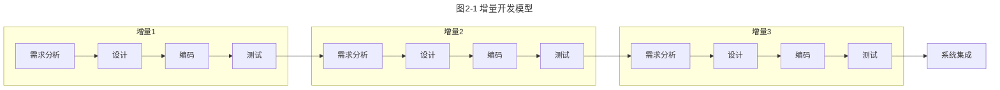

#### 2.1.2 软件过程活动、阶段活动成果描述

| 阶段 | 活动内容 | 成果物 |
|------|----------|--------|
| 需求分析 | 分析用户需求，确定功能范围 | 需求规格说明书 |
| 系统设计 | 架构设计、数据库设计、接口设计 | 设计说明书 |
| 编码实现 | 后端API开发、前端页面开发、小程序开发 | 源代码 |
| 系统测试 | 单元测试、集成测试、功能测试 | 测试报告 |
| 部署上线 | 系统部署、用户培训 | 用户手册 |

#### 2.1.3 软件开发计划

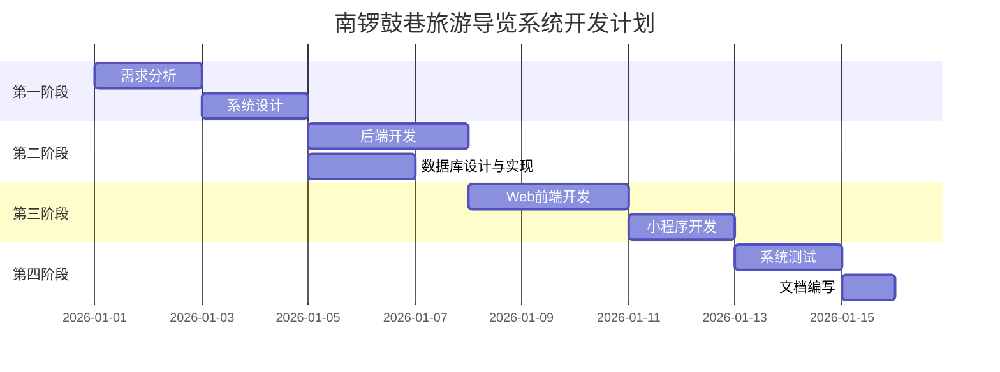

### 2.2 开发语言及开发环境

| 类别 | 技术选型 | 版本 |
|------|----------|------|
| 后端语言 | Python | 3.8+ |
| 后端框架 | Django + Django REST Framework | 4.2 / 3.14 |
| 前端框架 | Vue3 + Vite | 3.x / 4.x |
| UI组件库 | Element Plus | 2.x |
| 小程序 | 微信原生开发 | - |
| 数据库 | SQLite | 3 |
| 开发工具 | VS Code | - |
| 版本控制 | Git + GitHub | - |
| 操作系统 | Windows 10/11 | - |

---

## 3. 系统分析

本项目采用**面向对象分析方法**进行系统分析。

### 3.2 面向对象分析

#### 3.2.1 用例图

南锣鼓巷旅游导览系统的用例图设计如图3-1所示。系统包含两类参与者：游客和管理员。游客可以浏览胡同信息、查看景点、搜索景点、查看推荐路线；管理员可以管理胡同信息、景点数据和路线数据。

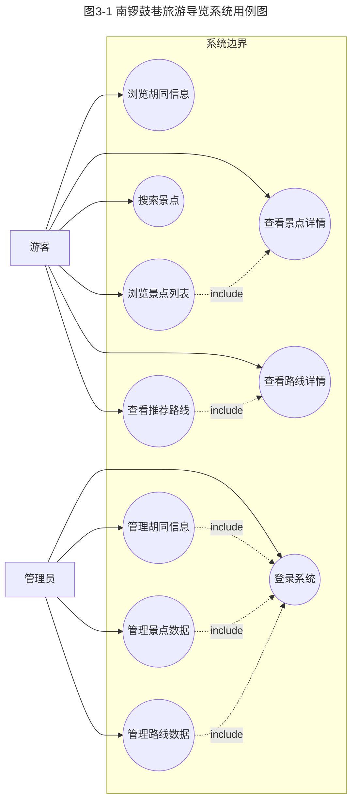

#### 3.2.2 用例描述

**1. 浏览景点列表用例**

游客进入景点列表页面，系统从数据库获取所有景点数据，以卡片形式展示景点信息。用例场景如表3-1所示。

表3-1 浏览景点列表用例场景

| 用例名称 | 浏览景点列表 |
|----------|-------------|
| 用例ID | UC02 |
| 参与者 | 游客 |
| 前置条件 | 系统正常运行 |
| 后置条件 | 显示景点列表 |
| 基本流程 | 1. 游客点击"景点"菜单<br>2. 系统查询景点数据<br>3. 系统以卡片形式展示景点列表<br>4. 游客浏览景点信息 |
| 扩展流程 | 3a. 若无景点数据，显示"暂无景点信息" |

**2. 搜索景点用例**

游客在搜索框输入关键词，系统根据关键词匹配景点名称和描述，返回搜索结果。用例场景如表3-2所示。

表3-2 搜索景点用例场景

| 用例名称 | 搜索景点 |
|----------|----------|
| 用例ID | UC04 |
| 参与者 | 游客 |
| 前置条件 | 游客在景点列表页面 |
| 后置条件 | 显示搜索结果 |
| 基本流程 | 1. 游客在搜索框输入关键词<br>2. 游客点击搜索按钮或按回车<br>3. 系统根据关键词查询匹配的景点<br>4. 系统显示搜索结果列表 |
| 扩展流程 | 3a. 若关键词为空，提示"请输入搜索关键词"<br>4a. 若无匹配结果，显示"未找到相关景点" |

**3. 查看推荐路线用例**

游客进入路线页面，查看系统推荐的游览路线，可展开查看路线包含的景点顺序。用例场景如表3-3所示。

表3-3 查看推荐路线用例场景

| 用例名称 | 查看推荐路线 |
|----------|-------------|
| 用例ID | UC05 |
| 参与者 | 游客 |
| 前置条件 | 系统正常运行 |
| 后置条件 | 显示路线列表及详情 |
| 基本流程 | 1. 游客点击"路线"菜单<br>2. 系统查询路线数据<br>3. 系统展示路线卡片列表<br>4. 游客点击"查看详情"<br>5. 系统展开显示路线景点顺序 |
| 扩展流程 | 5a. 再次点击"查看详情"收起景点列表 |

**4. 管理景点数据用例**

管理员登录后台，对景点数据进行增删改查操作。用例场景如表3-4所示。

表3-4 管理景点数据用例场景

| 用例名称 | 管理景点数据 |
|----------|-------------|
| 用例ID | UC08 |
| 参与者 | 管理员 |
| 前置条件 | 管理员已登录后台 |
| 后置条件 | 景点数据更新成功 |
| 基本流程 | 1. 管理员进入景点管理页面<br>2. 管理员选择操作（添加/编辑/删除）<br>3. 管理员填写/修改景点信息<br>4. 管理员提交保存<br>5. 系统验证数据并保存 |
| 扩展流程 | 5a. 若数据验证失败，提示错误信息 |


#### 3.2.3 实体类分析

通过对系统需求的分析，识别出以下实体类：

1. **Hutong（胡同）**：存储胡同基本信息
2. **POI（景点）**：存储景点详细信息
3. **Route（路线）**：存储推荐路线信息
4. **RoutePOI（路线景点关联）**：存储路线与景点的多对多关系
5. **User（用户）**：存储管理员账户信息

初步类图如图3-2所示：

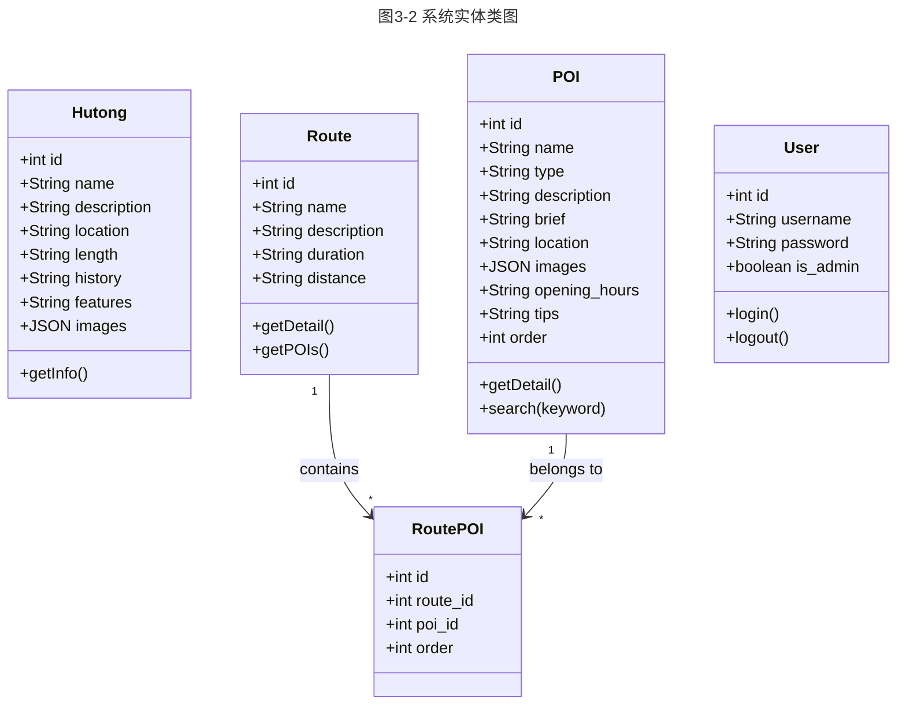

#### 3.2.4 用例分析

**1. 搜索景点用例分析**

搜索景点用例的分析类图如图3-3所示，包含边界类（SearchBar）、控制类（SearchController）和实体类（POI）。

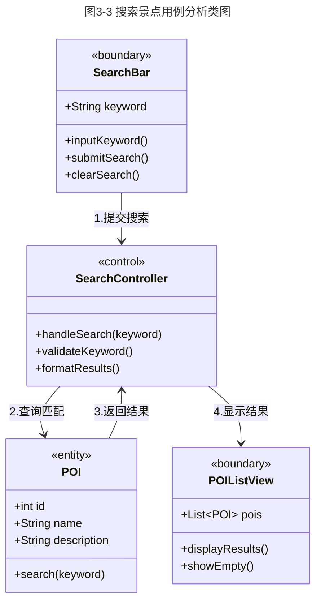

搜索景点用例的顺序图如图3-4所示：

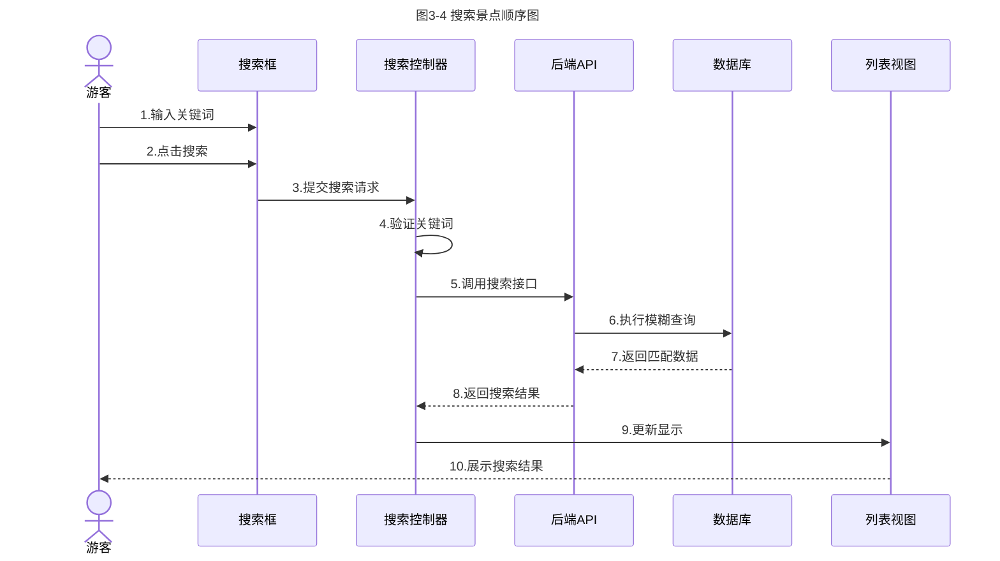

**2. 查看路线详情用例分析**

查看路线详情用例的分析类图如图3-5所示：

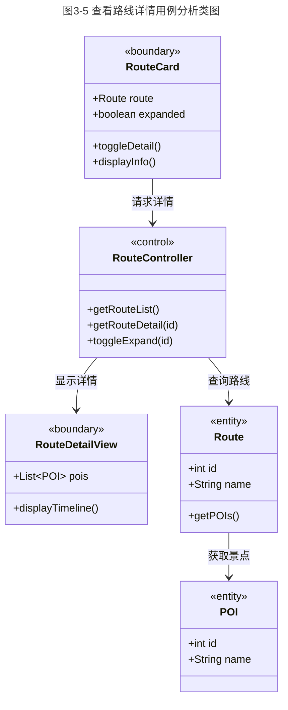

查看路线详情用例的顺序图如图3-6所示：

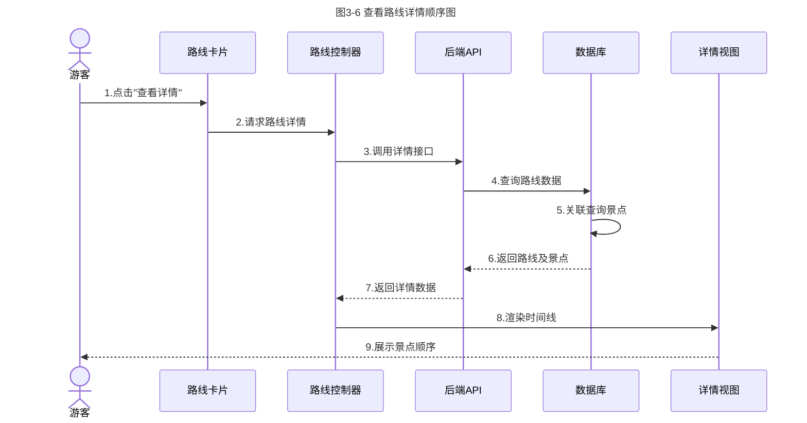

---

## 4. 系统设计

### 4.1 系统总体结构

本系统采用前后端分离的B/S架构，分为三个子系统：

1. **后端服务子系统**：提供RESTful API接口，处理业务逻辑
2. **Web前端子系统**：提供浏览器端用户界面
3. **小程序子系统**：提供微信小程序端用户界面

系统总体结构如图4-1所示：

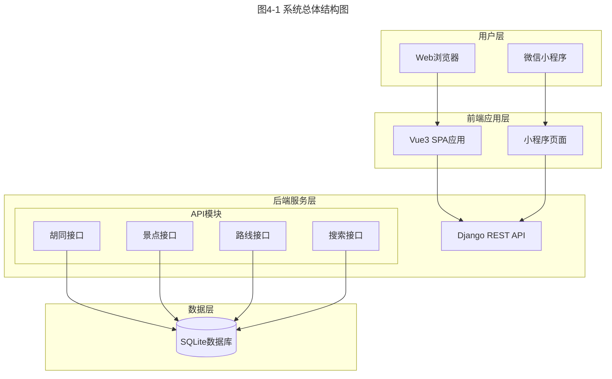

**子系统划分说明：**

| 子系统 | 主要功能 | 划分理由 |
|--------|----------|----------|
| 后端服务 | 数据存储、业务逻辑、API接口 | 统一数据管理，支持多端访问 |
| Web前端 | 浏览器端界面展示和交互 | 适合PC端用户，功能完整 |
| 小程序端 | 移动端界面展示和交互 | 适合移动端用户，便捷访问 |

系统模块结构如图4-2所示：

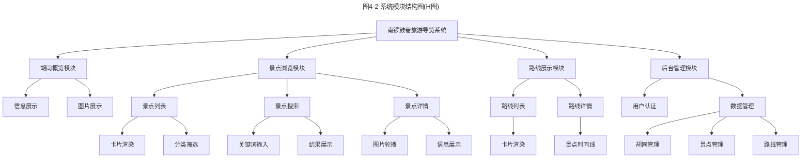


### 4.2 界面设计

#### 4.2.1 界面流程

系统界面标识及说明如表4-1所示：

表4-1 界面标识表

| 界面ID | 界面名称 | 所属模块 |
|--------|----------|----------|
| UI-01 | 首页 | 胡同概览 |
| UI-02 | 景点列表页 | 景点浏览 |
| UI-03 | 景点详情页 | 景点浏览 |
| UI-04 | 路线列表页 | 路线展示 |
| UI-05 | 后台登录页 | 后台管理 |
| UI-06 | 后台管理页 | 后台管理 |

界面流程图如图4-3所示：

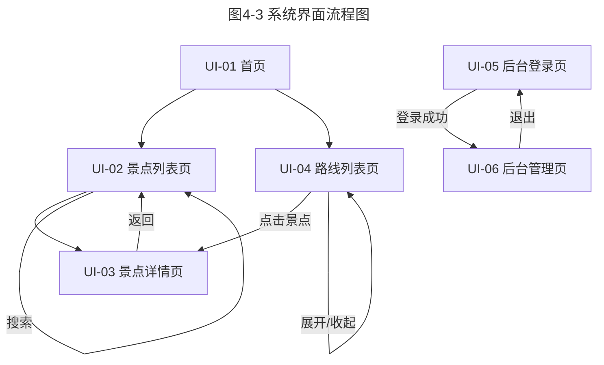

#### 4.2.2 主界面（首页）

首页界面视图如图4-4所示：

```
┌─────────────────────────────────────────────────────────────────────────────┐
│  🏮 南锣鼓巷旅游导览                    [首页]  [景点]  [路线]    ← 导航栏  │
├─────────────────────────────────────────────────────────────────────────────┤
│                                                                             │
│  ╔═══════════════════════════════════════════════════════════════════════╗  │
│  ║                         🏮 南锣鼓巷                                   ║  │
│  ║                                                                       ║  │
│  ║     南锣鼓巷是北京最古老的街区之一，位于北京市东城区...               ║  │
│  ║                                                                       ║  │
│  ║     📍 北京市东城区          📏 全长787米                             ║  │
│  ╚═══════════════════════════════════════════════════════════════════════╝  │
│                                    ↑ 胡同信息卡片                           │
│                                                                             │
│         ┌─────────────────────┐         ┌─────────────────────┐             │
│         │     🏠 景点列表      │         │     🗺️ 推荐路线      │             │
│         │     探索10+景点     │         │     2条主题路线     │             │
│         └─────────────────────┘         └─────────────────────┘             │
│                    ↑ 快捷入口卡片                                           │
│                                                                             │
├─────────────────────────────────────────────────────────────────────────────┤
│                          © 南锣鼓巷旅游导览系统                    ← 页脚   │
└─────────────────────────────────────────────────────────────────────────────┘
```

图4-4 首页界面视图

主界面对象功能说明：

| 对象 | 功能 | 操作方式 |
|------|------|----------|
| 导航栏 | 页面切换 | 点击菜单项跳转对应页面 |
| 胡同信息卡片 | 展示胡同基本信息 | 仅展示，无交互 |
| 景点列表入口 | 跳转景点列表页 | 点击跳转 |
| 推荐路线入口 | 跳转路线列表页 | 点击跳转 |

#### 4.2.3 景点列表界面

景点列表界面视图如图4-5所示：

```
┌─────────────────────────────────────────────────────────────────────────────┐
│  🏮 南锣鼓巷旅游导览                    [首页]  [景点]  [路线]              │
├─────────────────────────────────────────────────────────────────────────────┤
│                                                                             │
│                              🏠 景点列表                                    │
│                                                                             │
│                    ┌─────────────────────────────────┐                      │
│                    │  🔍 搜索景点...            [搜索]│  ← 搜索框           │
│                    └─────────────────────────────────┘                      │
│                                                                             │
│  ┌─────────────────────┐  ┌─────────────────────┐  ┌─────────────────────┐  │
│  │  ┌───────────────┐  │  │  ┌───────────────┐  │  │  ┌───────────────┐  │  │
│  │  │    [图片]     │  │  │  │    [图片]     │  │  │  │    [图片]     │  │  │
│  │  └───────────────┘  │  │  └───────────────┘  │  │  └───────────────┘  │  │
│  │  茅盾故居           │  │  齐白石旧居纪念馆   │  │  僧格林沁王府       │  │
│  │  [名人故居]         │  │  [名人故居]         │  │  [历史建筑]         │  │
│  │  简短描述...        │  │  简短描述...        │  │  简短描述...        │  │
│  └─────────────────────┘  └─────────────────────┘  └─────────────────────┘  │
│           ↑ 景点卡片（可点击进入详情）                                      │
│                                                                             │
└─────────────────────────────────────────────────────────────────────────────┘
```

图4-5 景点列表界面视图

景点列表界面对象功能说明：

| 对象 | 功能 | 操作方式 |
|------|------|----------|
| 搜索框 | 输入搜索关键词 | 输入文字，按回车或点击搜索 |
| 清除按钮 | 清空搜索恢复全部 | 点击清除 |
| 景点卡片 | 展示景点概要信息 | 点击进入详情页 |
| 类型标签 | 显示景点类型 | 仅展示 |

#### 4.2.4 景点详情界面

景点详情界面视图如图4-6所示：

```
┌─────────────────────────────────────────────────────────────────────────────┐
│  [← 返回列表]                                                    ← 返回按钮│
├─────────────────────────────────────────────────────────────────────────────┤
│                                                                             │
│  ╔═══════════════════════════════════════════════════════════════════════╗  │
│  ║                          [图片轮播区域]                               ║  │
│  ║                           ●  ○  ○  ○                    ← 轮播指示器  ║  │
│  ╚═══════════════════════════════════════════════════════════════════════╝  │
│                                                                             │
│    茅盾故居                                    [名人故居]   ← 名称和类型    │
│    📍 后圆恩寺胡同13号                                     ← 位置信息      │
│                                                                             │
│  ┌───────────────────────────────────────────────────────────────────────┐  │
│  │  ⏰ 开放时间：9:00-16:30                                              │  │
│  └───────────────────────────────────────────────────────────────────────┘  │
│  ┌───────────────────────────────────────────────────────────────────────┐  │
│  │  💡 游览提示：周一闭馆，免费参观需提前预约                            │  │
│  └───────────────────────────────────────────────────────────────────────┘  │
│  ┌───────────────────────────────────────────────────────────────────────┐  │
│  │  📖 详细介绍                                                          │  │
│  │  茅盾故居位于后圆恩寺胡同13号，是中国现代著名作家茅盾晚年居住和工作   │  │
│  │  的地方。这是一座典型的北京四合院，占地面积约800平方米...             │  │
│  └───────────────────────────────────────────────────────────────────────┘  │
│                                                                             │
└─────────────────────────────────────────────────────────────────────────────┘
```

图4-6 景点详情界面视图

#### 4.2.5 路线列表界面

路线列表界面视图如图4-7所示：

```
┌─────────────────────────────────────────────────────────────────────────────┐
│  🏮 南锣鼓巷旅游导览                    [首页]  [景点]  [路线]              │
├─────────────────────────────────────────────────────────────────────────────┤
│                                                                             │
│                              🗺️ 推荐路线                                    │
│                                                                             │
│  ╔═══════════════════════════════════════════════════════════════════════╗  │
│  ║  经典文化游                                                           ║  │
│  ║  探访名人故居，感受深厚的文化底蕴                                     ║  │
│  ║  ⏱️ 约2小时    📏 约1.5公里    📍 4个景点                             ║  │
│  ║                                          [查看详情 ▼]   ← 展开按钮    ║  │
│  ╚═══════════════════════════════════════════════════════════════════════╝  │
│                                                                             │
│  ┌───────────────────────────────────────────────────────────────────────┐  │
│  │  路线景点（展开后显示）：                                             │  │
│  │      ●─── 第1站 ─── 茅盾故居 [名人故居]                               │  │
│  │      │                                                                │  │
│  │      ●─── 第2站 ─── 齐白石旧居纪念馆 [名人故居]                       │  │
│  │      │                                                                │  │
│  │      ●─── 第3站 ─── 僧格林沁王府 [历史建筑]                           │  │
│  │      │                                                                │  │
│  │      ●─── 第4站 ─── 万庆当铺 [历史建筑]                               │  │
│  └───────────────────────────────────────────────────────────────────────┘  │
│                    ↑ 时间线形式展示景点顺序                                 │
│                                                                             │
└─────────────────────────────────────────────────────────────────────────────┘
```

图4-7 路线列表界面视图


### 4.3 数据库设计

#### 4.3.1 E-R图

系统E-R图如图4-8所示：

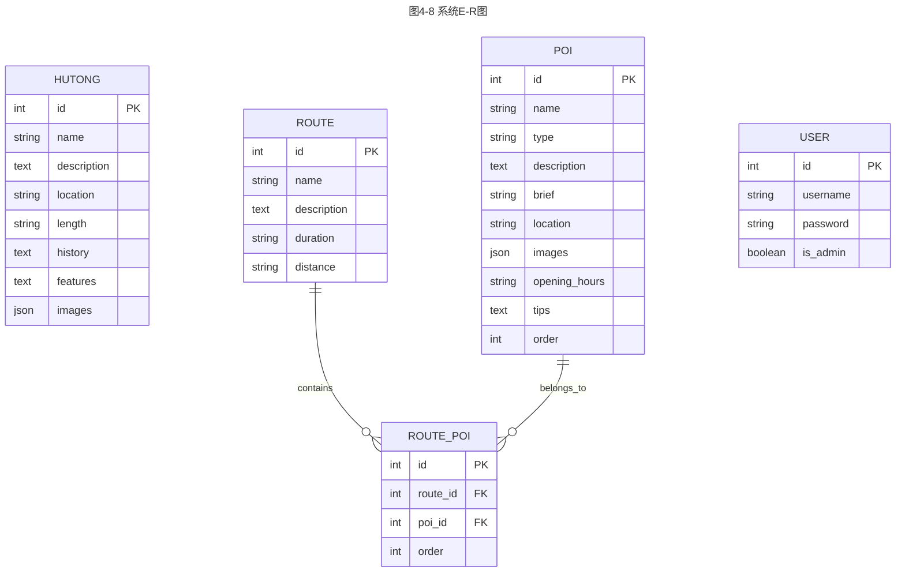

#### 4.3.2 表设计

**表4-2 Hutong（胡同信息表）**

| 表名 | tourism_hutong |
|:----:|:----:|
| 列名 | 数据类型（精度范围） | 空/非空 | 约束条件 |
|------|---------------------|---------|----------|
| id | INTEGER | 非空 | 主键，自增 |
| name | VARCHAR(100) | 非空 | 唯一 |
| description | TEXT | 非空 | - |
| location | VARCHAR(200) | 非空 | - |
| length | VARCHAR(50) | 可空 | - |
| history | TEXT | 可空 | - |
| features | TEXT | 可空 | - |
| images | JSON | 可空 | 默认[] |
| 补充说明 | 存储胡同基本信息，系统中仅一条记录 |

**表4-3 POI（景点信息表）**

| 表名 | tourism_poi |
|:----:|:----:|
| 列名 | 数据类型（精度范围） | 空/非空 | 约束条件 |
|------|---------------------|---------|----------|
| id | INTEGER | 非空 | 主键，自增 |
| name | VARCHAR(100) | 非空 | - |
| type | VARCHAR(20) | 非空 | 枚举值：celebrity/historic/food/shop/culture |
| description | TEXT | 非空 | 长度≥100 |
| brief | VARCHAR(200) | 非空 | - |
| location | VARCHAR(200) | 非空 | - |
| images | JSON | 可空 | 默认[] |
| opening_hours | VARCHAR(100) | 可空 | - |
| tips | TEXT | 可空 | - |
| order | INTEGER | 非空 | 默认0，用于排序 |
| created_at | DATETIME | 非空 | 自动生成 |
| 补充说明 | 存储景点详细信息，type字段使用枚举约束 |

**表4-4 Route（路线信息表）**

| 表名 | tourism_route |
|:----:|:----:|
| 列名 | 数据类型（精度范围） | 空/非空 | 约束条件 |
|------|---------------------|---------|----------|
| id | INTEGER | 非空 | 主键，自增 |
| name | VARCHAR(100) | 非空 | - |
| description | TEXT | 非空 | - |
| duration | VARCHAR(50) | 可空 | - |
| distance | VARCHAR(50) | 可空 | - |
| created_at | DATETIME | 非空 | 自动生成 |
| 补充说明 | 存储推荐路线基本信息 |

**表4-5 RoutePOI（路线景点关联表）**

| 表名 | tourism_routepoi |
|:----:|:----:|
| 列名 | 数据类型（精度范围） | 空/非空 | 约束条件 |
|------|---------------------|---------|----------|
| id | INTEGER | 非空 | 主键，自增 |
| route_id | INTEGER | 非空 | 外键，关联Route.id |
| poi_id | INTEGER | 非空 | 外键，关联POI.id |
| order | INTEGER | 非空 | 默认0，景点在路线中的顺序 |
| 补充说明 | 路线与景点的多对多关联表，order字段记录游览顺序 |

### 4.4 模块详细设计

#### 4.4.1 景点搜索模块详细设计

景点搜索模块的程序流程图如图4-9所示：

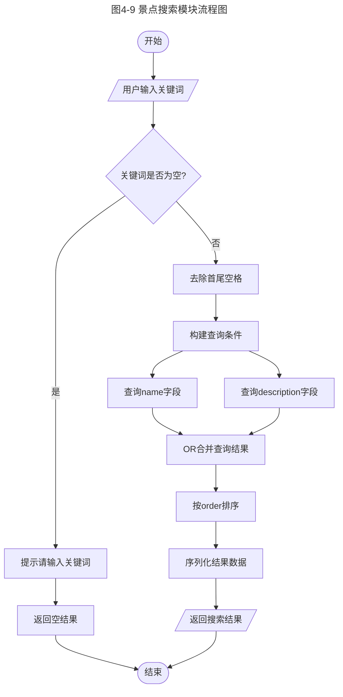

搜索模块核心代码逻辑：

```python
def search_pois(request):
    keyword = request.query_params.get('q', '').strip()
    if not keyword:
        return Response({'count': 0, 'results': [], 'message': '请输入搜索关键词'})
    
    pois = POI.objects.filter(
        Q(name__icontains=keyword) | Q(description__icontains=keyword)
    ).order_by('order', 'id')
    
    serializer = POIListSerializer(pois, many=True)
    return Response({'count': pois.count(), 'results': serializer.data})
```

#### 4.4.2 路线详情获取模块详细设计

路线详情获取模块的程序流程图如图4-10所示：

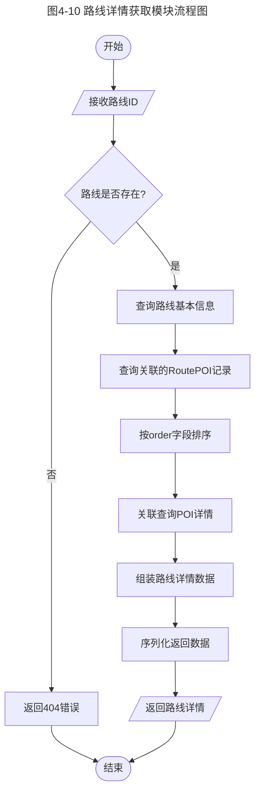

#### 4.4.3 景点详情展示模块详细设计

景点详情展示模块的程序流程图如图4-11所示：

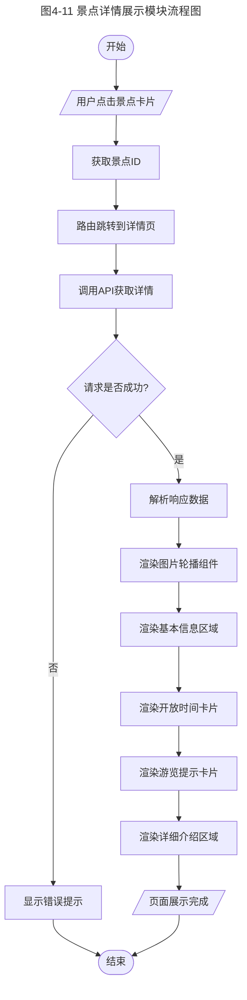

---

## 5. 系统测试

### 5.1 系统测试方法描述

本系统采用以下测试方法：

1. **功能测试**：验证系统各功能模块是否按需求正常工作
2. **接口测试**：验证后端API接口的正确性和稳定性
3. **兼容性测试**：验证系统在不同浏览器和设备上的表现
4. **用户体验测试**：验证界面交互的流畅性和易用性

测试环境配置：

| 项目 | 配置 |
|------|------|
| 操作系统 | Windows 10/11 |
| 后端环境 | Python 3.x + Django 4.2 |
| 前端环境 | Node.js 16.20.2 + Vue 3 |
| 数据库 | SQLite 3 |
| 浏览器 | Chrome 120+、Edge 120+ |

### 5.2 测试过程

#### 5.2.1 后端API测试

表5-1 后端API测试用例及结果

| 测试编号 | 测试内容 | 输入 | 预期输出 | 实际结果 | 状态 |
|----------|----------|------|----------|----------|------|
| TC-01 | 获取胡同信息 | GET /api/hutong/ | 返回胡同数据 | 正确返回 | ✓通过 |
| TC-02 | 获取景点列表 | GET /api/pois/ | 返回景点列表 | 返回10条 | ✓通过 |
| TC-03 | 获取景点详情 | GET /api/pois/1/ | 返回景点详情 | 正确返回 | ✓通过 |
| TC-04 | 获取不存在景点 | GET /api/pois/999/ | 返回404 | 404错误 | ✓通过 |
| TC-05 | 获取路线列表 | GET /api/routes/ | 返回路线列表 | 返回2条 | ✓通过 |
| TC-06 | 获取路线详情 | GET /api/routes/1/ | 返回路线及景点 | 正确返回 | ✓通过 |
| TC-07 | 搜索"故居" | GET /api/search/?q=故居 | 返回匹配景点 | 返回3条 | ✓通过 |
| TC-08 | 空关键词搜索 | GET /api/search/?q= | 返回提示信息 | 正确提示 | ✓通过 |
| TC-09 | 搜索无结果 | GET /api/search/?q=xyz | 返回空列表 | 空列表 | ✓通过 |

#### 5.2.2 前端功能测试

表5-2 前端功能测试用例及结果

| 测试编号 | 功能模块 | 测试步骤 | 预期结果 | 实际结果 | 状态 |
|----------|----------|----------|----------|----------|------|
| FT-01 | 首页 | 访问首页 | 显示胡同信息 | 正确显示 | ✓通过 |
| FT-02 | 导航 | 点击景点菜单 | 跳转景点列表 | 正确跳转 | ✓通过 |
| FT-03 | 景点列表 | 页面加载 | 显示景点卡片 | 显示10个 | ✓通过 |
| FT-04 | 搜索 | 输入"故居"搜索 | 显示匹配结果 | 正确过滤 | ✓通过 |
| FT-05 | 景点详情 | 点击景点卡片 | 跳转详情页 | 正确跳转 | ✓通过 |
| FT-06 | 图片轮播 | 切换图片 | 图片切换 | 正常切换 | ✓通过 |
| FT-07 | 路线列表 | 页面加载 | 显示路线卡片 | 显示2条 | ✓通过 |
| FT-08 | 路线展开 | 点击查看详情 | 展开景点列表 | 正确展开 | ✓通过 |
| FT-09 | 路线收起 | 再次点击 | 收起景点列表 | 正确收起 | ✓通过 |

#### 5.2.3 测试结果统计

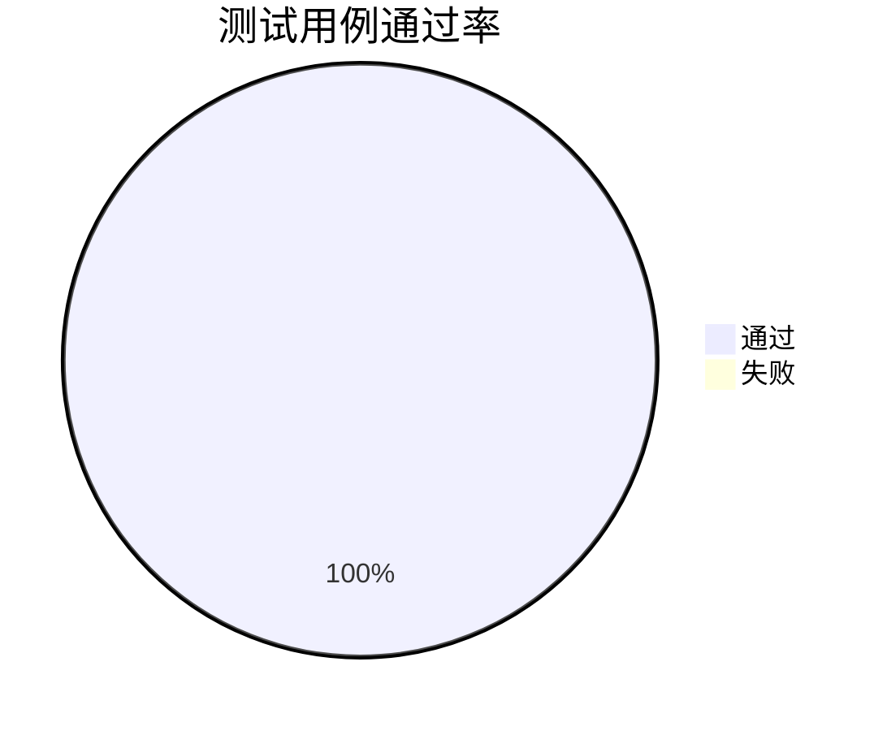

测试总结：
- 后端API测试：9个用例，全部通过，通过率100%
- 前端功能测试：9个用例，全部通过，通过率100%
- 总计：18个测试用例，全部通过，系统功能符合设计要求

---

## 6. 总结

### 6.1 项目完成情况

本项目成功完成了南锣鼓巷旅游导览系统的设计与开发，实现了以下功能：

1. **胡同概览**：展示南锣鼓巷历史、位置、特色信息
2. **景点浏览**：10个景点的列表展示和详情查看
3. **景点搜索**：支持中文关键词模糊搜索
4. **推荐路线**：2条主题路线及景点顺序展示
5. **后台管理**：Django Admin数据维护
6. **多端支持**：Web端和微信小程序端

### 6.2 技术收获

通过本项目的开发，掌握了以下技术：

1. **Django REST Framework**：快速构建RESTful API
2. **Vue3组合式API**：现代化前端开发模式
3. **前后端分离架构**：提高开发效率和系统可维护性
4. **微信小程序开发**：移动端应用开发能力
5. **Git版本控制**：团队协作开发流程

### 6.3 遇到的问题与解决

| 问题 | 解决方案 |
|------|----------|
| Node.js版本兼容 | 将Vite从5.x降级到4.x |
| PowerShell执行策略 | 直接使用虚拟环境Python路径 |
| 跨域访问问题 | 配置django-cors-headers |
| 多对多关系排序 | 使用中间表order字段 |

### 6.4 团队协作体会

1. **分工明确**：前后端分离使团队成员可以并行开发
2. **版本控制**：Git分支管理避免了代码冲突
3. **文档先行**：需求和设计文档减少了沟通成本
4. **持续集成**：定期合并代码保证系统稳定

### 6.5 改进方向

1. 增加用户评论和收藏功能
2. 集成地图导航功能
3. 添加语音讲解功能
4. 优化移动端适配体验
5. 引入CI/CD自动化部署

### 6.6 个人总结

#### 成员一：XXX

本次课程设计中，我与队友共同完成了南锣鼓巷旅游导览系统的开发，从需求分析到系统测试，全程参与了各个环节的工作。

**需求分析与系统设计阶段：**

在项目初期，我和队友一起进行了需求调研，分析了游客在游览南锣鼓巷时的实际需求。我们共同绘制了用例图，讨论确定了系统的功能边界。在数据库设计环节，我参与了E-R图的绘制和表结构的设计，特别是在处理路线与景点的多对多关系时，我们反复讨论，最终决定使用中间表并添加order字段来记录景点顺序。

**编码实现阶段：**

在后端开发中，我学习了Django REST Framework框架，参与编写了景点搜索接口和路线详情接口。搜索功能使用Django的Q对象实现了对名称和描述的模糊匹配，这让我对ORM查询有了更深的理解。

在前端开发中，我参与了景点列表页和详情页的开发。Vue3的组合式API让我印象深刻，相比传统的选项式API，代码组织更加清晰。我还参与了小程序首页和景点页的开发，学会了小程序的数据绑定和页面跳转机制。

**遇到的问题：**

开发过程中遇到了不少问题。跨域问题困扰了我们一段时间，最终通过配置django-cors-headers解决。Node.js版本兼容性问题也让我们走了弯路，后来将Vite降级才得以解决。这些经历让我认识到环境配置的重要性。

**收获与体会：**

这次项目让我真正体验了软件开发的完整流程。以前在课堂上学习的用例图、类图、顺序图等UML图，这次都在实际项目中得到了应用。我深刻体会到，好的设计文档能够大大减少编码阶段的困惑和返工。

团队协作方面，我们使用Git进行版本控制，通过分支管理避免了代码冲突。遇到问题时，两个人一起讨论往往能更快找到解决方案。这次合作让我认识到，软件开发不是一个人的事情，良好的沟通和协作至关重要。

---

#### 成员二：XXX

在本次南锣鼓巷旅游导览系统的开发中，我与队友密切配合，共同完成了从设计到实现的全部工作。

**参与需求分析与设计：**

项目开始时，我们一起阅读了设计指导书，讨论确定了选择南锣鼓巷作为目标胡同。在需求分析阶段，我参与编写了用例描述，明确了每个功能的输入输出和异常处理。系统设计阶段，我参与绘制了系统架构图和模块结构图，对前后端分离架构有了清晰的认识。

**全栈开发实践：**

后端方面，我参与了胡同信息接口和景点详情接口的开发，学会了使用Django的ModelSerializer进行数据序列化。在编写路线详情接口时，我学会了如何通过select_related优化数据库查询，减少N+1查询问题。

前端方面，我参与开发了推荐路线页面，实现了路线卡片的展开/收起功能。这个功能需要管理组件状态并异步加载数据，让我对Vue3的响应式原理有了更深的理解。Element Plus的Timeline组件帮助我们快速实现了景点顺序的时间线展示效果。

小程序方面，我参与了路线页面和景点详情页的开发。小程序的开发模式与Web前端有所不同，但核心思想是相通的。通过这次实践，我掌握了小程序的页面生命周期和API调用方式。

**解决技术难题：**

开发过程中，我们遇到了PowerShell执行策略限制的问题，无法激活Python虚拟环境。经过查阅资料，我们找到了直接使用虚拟环境Python路径的替代方案。前后端联调时的数据格式问题也困扰了我们一段时间，最终通过仔细对比接口文档和实际返回数据解决了问题。

**对软件工程的认识：**

通过这次项目，我对软件工程有了更深的认识。需求分析不是简单地列出功能点，而是要站在用户角度思考他们真正需要什么。系统设计不是画几张图，而是要为后续编码提供清晰的指导。测试不是走过场，而是保证软件质量的重要环节。

最让我感触深刻的是团队协作的重要性。两个人一起开发，遇到问题可以互相讨论，代码可以互相审查，效率比一个人单干高很多。Git的使用让我们能够并行开发而不互相干扰，这是现代软件开发必备的技能。

这次课程设计是一次宝贵的实践经历，让我将理论知识转化为了实际能力，为今后的学习和工作打下了良好的基础。

---

**附录：系统启动命令**

```bash
# 后端启动
cd backend
.\venv\Scripts\python.exe manage.py runserver

# 前端启动
cd frontend
npm run dev

# 访问地址
# Web前端：http://127.0.0.1:3000
# 后端API：http://127.0.0.1:8000/api/
# 后台管理：http://127.0.0.1:8000/admin/
```
